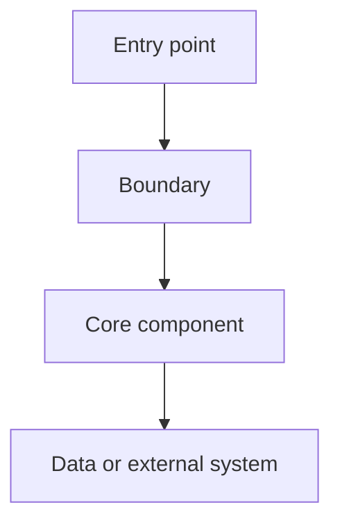

# Codebase Lens

Build a verifiable mental model of a code project. Do not produce a confident directory tour. Read the smallest useful set of files, connect conclusions to evidence, and explain what remains unknown.

## Operating contract

- Work read-first and preserve existing user changes.
- Do not install dependencies, switch branches, reset files, or edit source code.
- This skill is authorized to create or update the root `ONBOARDING.md` after investigation.
- Preserve manually written sections in an existing `ONBOARDING.md`; update generated sections rather than replacing the document.
- Read an existing `CONTEXT.md` or project vocabulary section before introducing terminology.
- Record confirmed project concepts, domain terms, abbreviations, and code-specific jargon in the onboarding document as a communication bridge.
- Read project configuration and entry points before reading broad areas of source.
- Treat names and directory conventions as search hints, not evidence.
- Do not claim runtime behavior from static code alone.
- Keep the investigation proportional to the user's question. For a large monorepo, establish the relevant package or service before exploring deeper.

## Investigation modes

Select the smallest mode that answers the request. Modes may be combined.

| Mode | Use when the user asks | Main result |
|---|---|---|
| `ORIENT` | “Explain this project” or “Where should I start?” | Project map, stack, entry points, architecture, reading path |
| `TRACE` | “How does this feature/request work?” | Evidence-backed path from entry to output and side effects |
| `IMPACT` | “What will this change affect?” | Dependency, blast-radius, test, and deployment analysis |
| `VERIFY` | “Is this understanding or implementation correct?” | Independent checks, contradictions, and remaining unknowns |

If no mode is named, use `ORIENT` for a broad request, `TRACE` for a named feature or endpoint, and `IMPACT` for a file, diff, commit, or pull request. Record the selected mode in the report.

## Evidence ledger

Attach an evidence label to every material conclusion:

- `SOURCE` — directly shown by source or configuration.
- `RUNTIME` — observed by executing a command; include the command, exit status, and relevant result.
- `INFERRED` — a conclusion supported by multiple signals; state the signals.
- `UNKNOWN` — the repository or environment does not establish the answer.
- `CONTRADICTED` — sources disagree; show both sides.

A static import or call graph is not `RUNTIME`. A passing test only supports the behavior asserted by that test. A skipped, flaky, timed-out, credential-blocked, or unavailable check remains an explicit limitation.

## Project vocabulary and communication bridge

Treat terminology as part of the project model, not as incidental prose. Capture terms that a new contributor, user, or future agent needs in order to communicate efficiently:

- Domain concepts such as `Order`, `Workspace`, `Run`, `Tenant`, or `Policy`.
- Project-specific meanings of common words such as “account”, “job”, “session”, or “member”.
- Abbreviations, acronyms, code names, legacy names, and user-facing labels.
- Concepts represented by types, database tables, API resources, events, state values, or queue names.
- Pairs that are easy to confuse, such as `User` versus `Account`, or `Job` versus `Run`.

For each term, record:

| Field | Meaning |
|---|---|
| Canonical term | The term agents and users should prefer |
| Code names and aliases | Identifiers, abbreviations, legacy names, or UI labels |
| Meaning | What the concept represents in this project |
| Boundaries | What it includes and what it must not be confused with |
| Lifecycle or relationships | Important states, owners, parents, or related concepts |
| Evidence | Files, symbols, API fields, tests, or user confirmation |
| Status | `CONFIRMED`, `CANDIDATE`, `AMBIGUOUS`, or `CONTRADICTED` |

Use `CONFIRMED` only when the meaning is supported by source, documentation, or explicit user clarification. Keep `CANDIDATE` terms visible when they are useful but not yet settled. When the same word has multiple meanings, surface the collision instead of silently choosing one. Use the canonical term in the response after it is established, and mention aliases once so the user can connect their language to the code.

Keep domain definitions focused on meaning and boundaries. Put implementation locations in the evidence and code-name columns; do not turn the glossary into a file-by-file catalog.

## Workflow

### 1. Establish scope and baseline

Identify:

- Current working directory and repository root.
- User-specified package, service, feature, file, diff, branch, or revision.
- Whether the repository is a monorepo.
- Current revision and worktree status.
- Existing `AGENTS.md`, `CLAUDE.md`, `.pi` instructions, or other project guidance.

Do not modify the worktree while establishing the baseline.

**Completion criterion:** The report states the exact repository scope, revision when available, selected mode, and any pre-existing uncommitted changes.

### 2. Reconnaissance

Inspect project landmarks before broad source exploration:

- README files and contributor documentation.
- Package manifests such as `package.json`, `pyproject.toml`, `go.mod`, `Cargo.toml`, `pom.xml`, `Gemfile`, or `pubspec.yaml`.
- Build, start, test, and lint scripts.
- Application bootstrap files.
- HTTP routes, CLI registration, event consumers, scheduled jobs, or queue workers.
- Database migrations, schemas, ORM configuration, and external-service clients.
- CI, Docker, deployment, and environment-variable examples.

Use directory listings and targeted text searches to narrow the next files. Avoid reading generated directories, dependency vendors, build output, and caches unless the question specifically concerns them.

**Completion criterion:** The report lists confirmed languages, frameworks, versions when present, run commands, entry candidates, system boundaries, and initial vocabulary candidates, each with evidence or an `UNKNOWN` label.

### 3. Apply the project-type strategy

After detecting the stack, use the matching strategy below. Combine strategies for polyglot repositories. These are search priorities, not assumptions about the architecture.

| Project type | Inspect first | Trace especially |
|---|---|---|
| React / Next.js / Vue / Angular | app bootstrap, routes, pages, components, state stores, API clients | page → state/query → API → rendering |
| Node.js / Express / NestJS | bootstrap, module registration, routes/controllers, middleware, services, repositories | request → middleware → controller → service → persistence |
| Python / Django / Flask / FastAPI | app factory, settings, routers/views, dependencies, services, models, tasks | request → dependency/auth → handler → service → ORM/external call |
| Java / Spring | application class, configuration, controllers, filters, services, repositories, entities | request → filter → controller → service → repository → response |
| Go | `cmd/`, `internal/`, `main`, router setup, handlers, services, interfaces, migrations | server startup → middleware → handler → use case → store |
| Rust | workspace manifest, binaries, `main`/`lib`, modules, traits, handlers, adapters | binary → module/trait boundary → use case → adapter |
| Ruby / Rails | routes, controllers, models, jobs, concerns, initializers | route → controller → model/service → job or response |
| Mobile applications | app bootstrap, navigation, screens, state management, repositories, platform services | app start → navigation → screen → state → repository |
| CLI tools | executable entry, argument parser, command registry, handlers, config loading | process → parser → command → domain operation → output |
| Libraries / SDKs | public exports, package entry, interfaces, adapters, examples, contract tests | consumer API → core abstraction → implementation/transport |

For an unlisted stack, derive a strategy from its actual manifest, bootstrap mechanism, public boundary, and tests. Never force a listed pattern onto the project.

**Completion criterion:** The chosen strategy names the files and symbols it used; each inferred layer is backed by code, configuration, or is marked `INFERRED`.

### 4. Capture the vocabulary bridge

During reconnaissance and flow tracing, extract terminology from documentation, type and class names, database schemas, API resources, events, state machines, tests, UI labels, and user language. Reconcile these terms with any existing `CONTEXT.md` or glossary.

Prefer one canonical term for each concept. Record aliases and code identifiers so users can ask in natural language while the agent can find the corresponding implementation. Explicitly record confusing near-synonyms and overloaded terms. If source and documentation disagree, preserve both observations and mark the term `CONTRADICTED` until clarified.

Do not promote a guess to canonical vocabulary. If a concept is only visible through a name or a single ambiguous use, record it as `CANDIDATE` with the evidence needed to confirm it.

**Completion criterion:** The project has a vocabulary table containing the important confirmed terms, useful candidates, aliases, confusing pairs, and unresolved terminology conflicts.

### 5. Build the architecture map (`ORIENT`)

Compress the project into 5–7 meaningful components rather than summarizing every file. For each component record:

- Responsibility.
- Public or internal entry point.
- Important dependencies and dependents.
- Key files and symbols.
- Data or control boundary.
- Evidence label.

Prefer a dependency-ordered reading path of no more than 12 files. Include tests and configuration when they explain behavior better than implementation files.

**Completion criterion:** Every core component has at least one path and symbol as evidence, and the reading path explains why each file comes next.

### 6. Trace a concrete flow (`TRACE`)

Name the object being traced: URL, CLI subcommand, page, event, job, type, class, or function. Follow the actual registration and call relationships:

```text
entry → registration/router → parsing/validation → orchestration → persistence or external call → state change → output
```

Record conditions, error paths, retries, transactions, authorization, caching, and other side effects. For dependency injection, reflection, dynamic registration, or configuration-driven behavior that cannot be statically confirmed, use `UNKNOWN` or `INFERRED`.

**Completion criterion:** The result is a causal, ordered path with a file, symbol, role, and evidence label for every important node.

### 7. Analyze change impact (`IMPACT`)

For a target file, symbol, diff, commit, or feature, inspect:

- Direct importers, callers, subclasses, and implementations.
- Reverse callers and exposed APIs, routes, commands, events, or exports.
- Shared types, schemas, configuration, database tables, and serialized formats.
- Unit, integration, end-to-end, contract, and snapshot tests.
- Build, deployment, permission, performance, and compatibility boundaries.

Classify findings as direct impact, indirect impact, validation required, or no evidence.

**Completion criterion:** Every reported impact has a relationship and evidence; possible relevance is not presented as confirmed impact.

### 8. Independently verify (`VERIFY`)

Use evidence that is different from the initial path:

- Search from callers back toward the target.
- Compare registration sites with configuration.
- Compare implementation behavior with test inputs and assertions.
- Run a focused existing check only when it is safe and appropriate; record its exact result.
- Re-check the worktree after commands that might create files.

If a command cannot run because of missing dependencies, services, credentials, or environment restrictions, report the blocker and leave the conclusion unverified.

**Completion criterion:** Each key conclusion is supported, contradicted, or explicitly unresolved, and the report lists the remaining unknowns.

## Parallel subagent analysis in Pi

When the Pi subagent facility is available and the investigation is broad enough to benefit from independent evidence, use a single `workflowScript` with a small parallel fanout. Before launching, inspect available agent capabilities and launch only executable, non-disabled agents.

Use read-only children with distinct seams:

1. **Structure scout** — manifests, directory boundaries, bootstrap files, entry points, and run commands.
2. **Flow scout** — the named feature, endpoint, command, event, or data path.
3. **Quality scout** — tests, conventions, configuration, deployment, and likely impact boundaries.

Each child receives a complete task contract: repository and scope, read-only authority, target question, evidence format, stop conditions, and concise output. Do not launch duplicate scouts. Children return reports; they do not edit `ONBOARDING.md` and do not spawn further agents.

Conceptual Pi orchestration shape:

```js
subagent({
  async: true,
  context: "fresh",
  workflowScript: `
    const reports = await runs.all([
      { key: "structure", agent: "scout", task: "Read-only structure analysis of the specified repository. Report manifests, stack, entry points, boundaries, commands, and evidence paths." },
      { key: "flow", agent: "scout", task: "Read-only flow analysis of the specified feature or entry point. Trace callers, callees, side effects, and unknown dynamic edges with evidence." },
      { key: "quality", agent: "scout", task: "Read-only analysis of tests, conventions, configuration, deployment, and likely impact boundaries. Report evidence and gaps." }
    ]);
    return reports.map(report => report.output);
  `
})
```

The parent agent remains responsible for scope, conflict resolution, synthesis, writing the onboarding document, and the final report. If subagents are unavailable or the task is small, perform the equivalent focused investigation directly.

**Completion criterion:** Parallel reports have distinct scopes, are reconciled against the actual files, and no child conclusion is accepted without evidence.

## Automatic `ONBOARDING.md` generation

After completing `ORIENT`, or after a focused investigation materially improves the project map, create or update the root `ONBOARDING.md` automatically.

Preserve existing manually authored material. Maintain a clearly marked generated section with the revision and generation date. Do not write speculative content into the generated section. If the repository is not writable, provide the complete proposed content in the response and explain the write failure.

Use this structure:

````md
# Project Onboarding

> Generated section: revision `<revision>`, date `<date>`.
> Regenerate with `/codebase-lens`.

## One-line overview

## Scope and confidence
- Scope:
- Revision:
- Modes:
- Evidence limitations:

## Technology and commands

## Architecture map



The diagram must represent only evidence-backed relationships. Label uncertain edges or nodes as `INFERRED` or `UNKNOWN`, and add a short legend below the diagram. Keep it readable with 5–7 primary components; use a separate focused diagram for a detailed flow.

## Directory and component map

| Component | Responsibility | Key paths and symbols | Evidence |
|---|---|---|---|

## Startup and request / command lifecycle

## Project vocabulary

| Canonical term | Code names and aliases | Meaning and boundaries | Lifecycle / relationships | Evidence | Status |
|---|---|---|---|---|---|

Use this section as the shared language between the project and future agents. Prefer canonical terms in conversation and mention aliases when they help users find the matching code.

## Important configuration and external dependencies

## Conventions and testing

## Recommended reading order

1. `path/to/file` — why it matters

## Open questions and verification gaps
````

For `TRACE`, add or update a focused flow section in `ONBOARDING.md`. For `IMPACT`, add the target, affected components, tests to inspect, and unresolved risks. Keep the document scannable; do not append repeated reports on every invocation.

**Completion criterion:** `ONBOARDING.md` exists or a documented write failure is reported; its generated section matches the current evidence, contains the vocabulary bridge, and contains an architecture Mermaid diagram or an explicit reason a diagram could not be established.

## Response formats

Choose the smallest useful response format. Always include evidence for material claims.

### Overview

```md
# Project understanding

## Scope
## One-line overview
## Technology and run commands
## Architecture map
## Project vocabulary
## Startup flow
## Recommended reading order
## Unknowns
```

### Focused flow

```md
# [Feature] flow

Entry → ... → output

| Order | File and symbol | Role | Side effects | Evidence |
|---|---|---|---|---|

## Branches and error paths
## Related tests
## Unverified relationships
```

### Impact analysis

```md
# Impact of [target]

## Direct impact
## Indirect impact
## Tests and configuration to inspect
## Risks
## Evidence and unknowns
```

## Final checklist

Before finishing, confirm:

- The repository scope and revision are explicit.
- Important claims have paths, symbols, commands, or evidence labels.
- Static analysis is not presented as runtime verification.
- Directory names were not treated as proof.
- Direct impact, inferred impact, and unverified risk are separate.
- Existing user changes and manual onboarding content were preserved.
- `ONBOARDING.md` was created or updated after the investigation.
- Important project vocabulary, aliases, confusing pairs, and unresolved terminology conflicts were recorded.
- The Mermaid diagram contains only supported relationships and has an uncertainty legend.
- Subagent reports, when used, were parallel, read-only, distinct, and reconciled by the parent.
